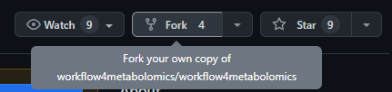
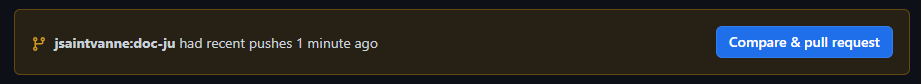

[](https://github.com/jsaintvanne/workflow4metabolomics/actions/workflows/publish.yml/badge.svg)


# How to contribute to the documentation?

If you want to contribute to this documentation on Workflow4Metabolomics, you will need to have a Github account first. Indeed, every files of this documentation are pushed in github and will stay there. To be able to accept new things from different people, we need to set some steps to follow:

1. Start by forking the repository: 



2. Then you can work directly on github or clone the repository to your local environment (link clone)

3. Once you have saved your changes (with commits pushed on your forked repository) there should be an orange band like the following to ask for a pull request 

4. You just have to open this pull request and we will review it in order to validate it. Please think about explaining your changes in your newly opened pull request for us to know what is is all about. Once the pull request is aprouved, changes will appear on the website.


### Tip: Adding information on a page

If you just want to add some information on an existing page or update some deprecated information, it is quite easy to do. 
During the previous step n°2, you just have to open the file you want to change (on Github or on your local computer if cloned), make your changes and then save it in a new commit.
When your commit is saved with changes, the orange band will appear and you can proceed with the previous step n°3 (or continue by updating further content). 

### Tip: Creating a new page

It is also possible to add a new page on the website. This is different from the previous point because you will need to change the `_quarto.yml` file also. To be able to do this, start with thinking about *Where can my new page be on the website? A new item in the menu? A new tab in an existing one?*. 
Then in the file named `_quarto.yml` find the good part and add it with these information: 
```{R}
 - text: "Tools"
        icon: "tools"
        menu: 
          - text: "Tool 1"
            href: tool1.qmd
          - text: "My new tool"
            href: mynewtool.qmd
```

As you can see, you now need to create your new `mynewtool.qmd` file. In this file you can write all you want (in accordance with where it will be in the website of course!).
After all this is completed, as in the previous tip, just save and open the pull request explaining what you want to add for us to be able to evaluate its accordance to the website.