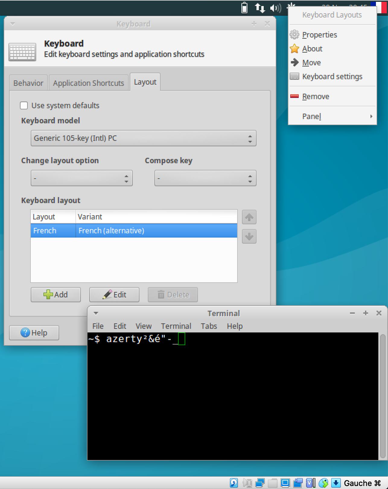

# Planemo Virtual Machine

## Prerequisite
- [VirtualBox](https://www.virtualbox.org/)
- Planemo OVA image: https://images.galaxyproject.org/planemo/latest.ova

## 1- Configure the VM before launch
1. Right click on the image name
2. Configuration...
  - Général
    - Avancée
      - Presse papier partagé: Bidirectionel
  - System|Système:
    - Carte mère|Mother board:
      - Fix the Memory with the slider to at least 4000Mo if you can. Otherwise, 2000Mo will be ok.
    - Processor|Processeur
      - Fix the number to 2 (or 1) depending of your hardware

## 2- Launch the VM

## 3- Configure after the launch
1. Click right on the US flag
2. Click on `Keyboard settings`
3. Click on the `Layout` tab
4. + Add
5. Find `French(alternative)``
6. Remove the English one
7. Test the keyboard using the `Terminal Emulator`

## [optional] Mount the host directory within the VM
Mouhai!